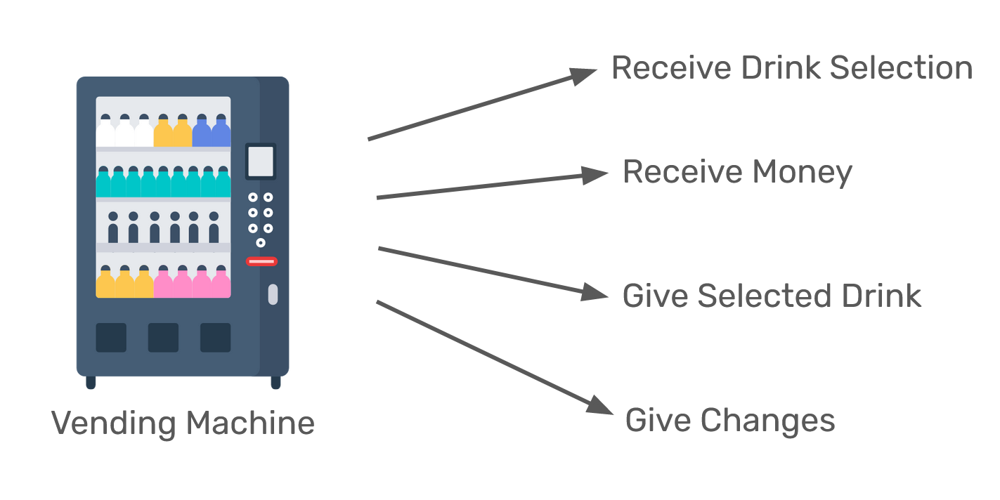
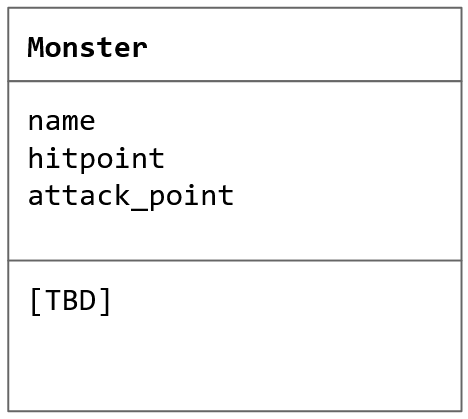
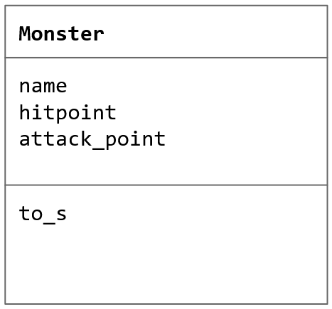
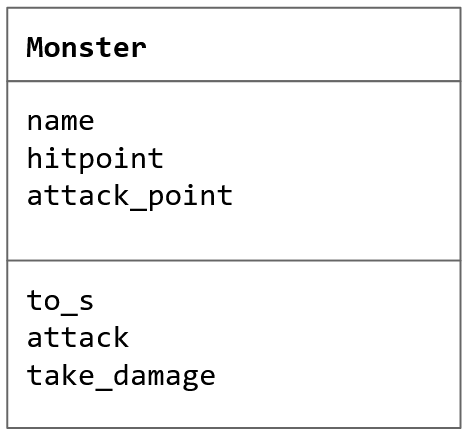
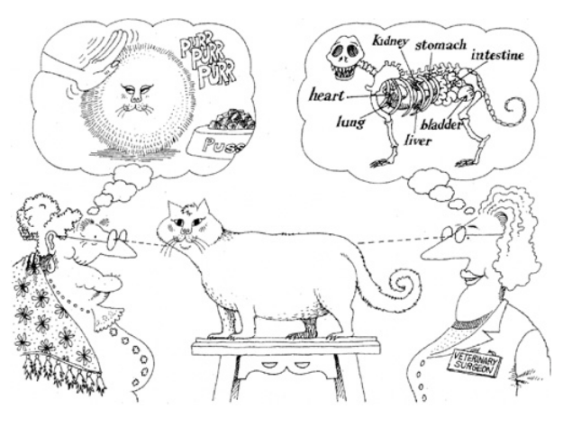
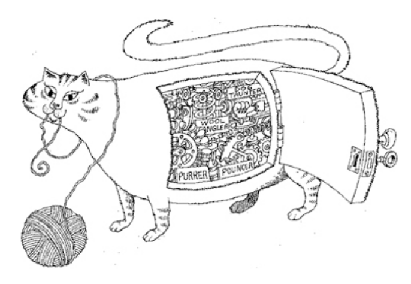

# Abstraction and Encapsulation


In our daily life, whether we realize it or not, we constantly interact with abstractions. Take an electrical switch as pictured above, for example. An electrical switch is an abstraction that hides away how electric circuits work. As a user, we don't necessarily need to understand how to connect and disconnect electrical circuits in order to allow the electrical current to flow to our electrical devices. We only need to understand that when we press the switch on, we are turning on our electronic devices, and when we press the switch off, we are turning the devices off as well.

Like an electrical switch, a software is also an abstraction. If you are a Gopay user, for instance, you don't necessarily need to understand how a POS app in the cashier notifies Gopay server to deduct your balance when you are buying a cup of cappuccino in a coffee shop with your Gopay wallet. The Gopay app hides all those complexity away from you and giving you an easy-to-use interface instead. This is the core essence of an abstraction. This is also the reason why we think it's better for you to train yourself to abstract things out in your program by learning the Object Oriented Programming (OOP) paradigm.

## Procedural vs Object Oriented Approach

To start, let's write some code. Suppose you are tasked with writing a program that calculates the area and perimeter of a rectangle. In a procedural approach, you might write something like this:

```ruby
print "insert length: "
length = gets.chomp.to_i

print "insert width: "
width = gets.chomp.to_i

puts "rectangle area: " + (length * width).to_s
puts "rectangle perimeter: " + (2 * length + 2 * width).to_s
```

While the code above works, it is not an Object Oriented (OO) code. Now, let's take a look at the following code:

```ruby
class Rectangle
  def initialize(length, width)
    @length = length
    @width = width
  end

  def area
    @length * @width
  end

  def perimeter
    @length * 2 + @width * 2
  end
end
```

With the class we created above, we are hiding the actual implementations of calculating the area and perimeter of a rectangle from the code that calls them.

```ruby
print "insert length: "
length = gets.chomp.to_i

print "insert width: "
width = gets.chomp.to_i

rectangle = Rectangle.new(length, width)

puts "rectangle area: #{rectangle.area.to_s}" 
puts "rectangle perimeter: #{rectangle.perimeter.to_s}"
```

In summary, abstraction is used to handle complexity by hiding unnecessary details from users.



## How to Create Abstraction and Encapsulation?

Let's learn by trying to solve a problem statement!

### Consolémon

Suppose you are tasked to create a game called Consolémon (short for Consolé Monster). Consolémon is a turn based card game for two players, similar to its doppelganger Pokémon. 

In our first iteration of the game, whenever the game is started, players will be given three random monstrers from the list of five possible monsters. Each monster has a hitpoint and attack point. Each turn, each player has to choose which monster they will use to attack and which opponent's monster they want to attack. When a monster A attacks monster B, monster B's hitpoint will be reduced as much as monster A's attack point, but Monster A's hitpoint will be reduced by 50% of monster B's attack point. If a monster loses all of its hitpoint, it will get knocked out. The first player to knock out all of their opponent's monsters wins the game.

Below is the list of five possible monsters:
- Phpkachu: 80 hitpoints, 50 attack points
- Sqlrtle: 100 hitpoints, 20 attack points
- Cppmander: 40 hitpoints, 80 attack points
- Bashtoise: 60 hitpoints, 60 attack points
- Torterraform: 120 hitpoints, 10 attack points

Below is an example of how the game looks like:

```
Player 1:
Phpkachu[80], Cppmander[40], Torterraform[120]

Player 2:
Sqlrtle[80], Cppmander[40], Bashtoise[60]

Turn 1

Player 1's Phpkachu attacks opponent's Cppmander, deals 50.0 damage and takes 40.0 damage

Player 1:
Phpkachu[40], Cppmander[40], Torterraform[120]

Player 2:
Sqlrtle[80], Cppmander[X], Bashtoise[60]

Player 2's Bashtoise attacks opponent's Cppmander, deals 60.0 damage and takes 40.0 damage

Player 1:
Phpkachu[40], Cppmander[X], Torterraform[120]

Player 2:
Sqlrtle[80], Cppmander[X], Bashtoise[20]

```

The game continues to Turn 2, Turn 3, and so on until one or both of the players lose all their monsters.

### Quiz 1

For the time being, we will start slow. For now, you are only asked to write a class to model the monsters. It is important for yourself that you take the time to write the class on your own before continue reading the rest of this material!

### Designing a Class

Now that you have tried to write a class to model the monsters, let's reflect a little bit on what you built. How did you create the class? Probably the better question is, what constitutes a class?

In object oriented programming, an object should consist of at least a **state** and a **behavior**. States (or sometimes also called attributes) are the data that an object stores. Behaviors are actions that can be performed on its data. When it comes to designing a class, **abstraction** is about **choosing relevant states and behaviors** that we need **to model** our **objects**.

**Classes are the template for our objects**. We model our objects by creating classes from which they will be instantiated. Hence, **objects are instances of classes**.

Having understanding this, you might want to revisit your solution. Let's start with asking ourselves what is the most simple class that we can build? I would argue we can start with a class named `Monster` with three attributes, `name`, `hitpoint`, and `attack_point`. In a diagram, our class now looks something like this:



Following is the implementation of our class in Ruby. If you haven't written one already, write the following snippet in a file named `monster.rb`.

```ruby
# monster.rb
class Monster
  def initialize(name, hitpoint, attack_point)
    @name = name
    @hitpoint = hitpoint
    @attack_point = attack_point
  end
end
```

In your `main.rb`, you can now instantiate a list of five possible monsters:

```ruby
# main.rb
require_relative 'monster'

phpkachu = Monster.new('Phpkachu', 80, 50)
sqlrtle = Monster.new('Sqlrtle', 100, 20)
cppmander = Monster.new('Cppmander', 40, 80)
bashtoise = Monster.new('Bashtoise', 60, 60)
torterraform = Monster.new('Torterraform', 120, 10)
monsters = [phpkachu, sqlrtle, cppmander, bashtoise, torterraform]
```

Next, how to print each monster in accordance to the expected output in our problem statement? The 'wrong' way would be:

```ruby
# main.rb

# ...
monsters.each do |monster|
  if monster.hitpoint > 0
    puts "#{monster.name}[#{monster.hitpoint}]"
  else
    puts "#{monster.name}[X]"
  end
end
```

If we don't consider object oriented principles, there is nothing wrong with printing each monster the way we did in the code snippet above. However, if we are to do a proper object oriented programming, we want to hide implementation details from the users of our classes. Rather than accessing our object's states directly like in the snippet above, we rather hide this implementation as a behavior named `to_s`. This way of writing codes in which we **restrict direct access to an object's data** is called **encapsulation**.

```ruby
# monster.rb
class Monster
  # ...

  def to_s
    if @hitpoint > 0
      "#{@name}[#{@hitpoint}]"
    else
      "#{@name}[X]"
    end
  end
end
```
This way, when we need to interact with `monster` objects in our `main.rb`, the code that calls `monster` object does not have to know what states/attributes that `monster` object has.

```ruby
# main.rb

# ...
monsters.each do |monster|
  puts monster
end
```

After adding `to_s` behavior, our `Monster` class diagram looks something like this:



### Quiz 2

Using the same principle, now try to implement a behavior for when an object from the `Monster` class attacks another `monster` object! Don't continue this material until you finish writing your solution.

### Designing Behaviors

```ruby
# monster.rb
class Monster
  # ...

  def attack(monster)
    puts "#{@name} attacks #{monster.name}, deals #{@attack_point} damage and takes #{0.5 * monster.attack_point} damage"
  end
end
```

In our `main.rb`, we can do something like:

```ruby
# main.rb

# ...
phpkachu.attack(cppmander)
```

But of course you see something weird here, right? Even though we have implemented `attack` behavior, we haven't actually change any states of our `monster` objects. By now you should have understood that the following is a non object oriented way to implement this behavior:

```ruby
# main.rb

# ...
phpkachu.attack(cppmander)
cppmander.hitpoint -= phpkachu.attack_point
phpkachu.hitpoint -= 0.5 * cppmander.attack_point
```

Take your time to implement this behavior in the proper object oriented manner!

If you have been paying good attention, you might have implemented this behavior like the following snippet:

```ruby
# monster.rb
class Monster
  # ...

  def attack(monster)
    monster.hitpoint -= @attack_point
    @hitpoint -= 0.5 * monster.attack_point

    puts "#{@name} attacks #{monster.name}, deals #{@attack_point.to_f} damage and takes #{0.5 * monster.attack_point} damage"
  end
end
```

However, we can actually make it even better. Instead of having the implementation details on how a `monster` object takes a damage, we can just encapsulate that behavior into its own method, let's name it `take_damage`. This way, in our `attack` method, whenever any object takes damage, we can just call that object's `take_damage` method and pass the amount of damage it should take. Our implementation now should look something like this:

```ruby
# monster.rb
class Monster
  # ...

  def attack(monster)
    monster.take_damage(@attack_point)
    take_damage(0.5 * monster.attack_point)

    puts "#{@name} attacks #{monster.name}, deals #{@attack_point.to_f} damage and takes #{0.5 * monster.attack_point} damage"
  end

  def take_damage(amount)
    @hitpoint -= amount
  end
end
```

After implementing these behaviors, our `Monster` class diagram looks something like this:



And your code should look something like this:

```ruby
# monster.rb
class Monster
  def initialize(name, hitpoint, attack_point)
    @name = name
    @hitpoint = hitpoint
    @attack_point = attack_point
  end

  def to_s
    if @hitpoint > 0
      "#{@name}[#{@hitpoint}]"
    else
      "#{@name}[X]"
    end
  end

  def attack(monster)
    monster.take_damage(@attack_point)
    take_damage(0.5 * monster.attack_point)

    puts "#{@name} attacks #{monster.name}, deals #{@attack_point.to_f} damage and takes #{0.5 * monster.attack_point} damage"
  end

  def take_damage(amount)
    @hitpoint -= amount
  end
end
```

The following `main.rb` is just to show you how your monsters look like once one of it attacks another.

```ruby
# main.rb
require_relative 'monster'

phpkachu = Monster.new('Phpkachu', 80, 50)
sqlrtle = Monster.new('Sqlrtle', 100, 20)
cppmander = Monster.new('Cppmander', 40, 80)
bashtoise = Monster.new('Bashtoise', 60, 60)
torterraform = Monster.new('Torterraform', 120, 10)

phpkachu.attack(cppmander)

monsters = [phpkachu, sqlrtle, cppmander, bashtoise, torterraform]
monsters.each do |monster|
  puts monster
end
```

## Benefits of Abstraction and Encapsulation

1. Easier to reason and work with

    In a more complex class, the user of the class attributes and methods do not need to know the detail implementation of the class. The user only needs to know what values are passed from the method.

2. Reusable

    Encapsulation also improves the code’s reusability and its ease of change when new requirements arise. We can minimize changes related to some attributes to one class only.
   
3. Easier to test

    Later on, we will learn about test-driven development (TDD). Once we learn TDD, you will begin to appreciate how easy it is to test code constructs that are well abstracted and encapsulated.


## Summary

For abstraction to work,



Implementations must be encapsulated.



## Homework

For your homework, write a class to model the two players. When you are writing this class, ask the following questions:
- what attributes are relevant to this class?
- what behaviors does this class should have?
- how to design these behaviors so that in `main.rb`, we only need to know as little as possible about the states that the objects of this class store internally?

We expect your submission to contain the following files:
- `monster.rb` as we have written above
- `[your_class_name].rb`
- `main.rb` to instantiate objects from `monster` and `your_class_name` classes and call their respective methods to at least simulate one turn in which Player 1 uses their monster to attack one of Player 2's monsters and vice versa.

Below is the skeleton of your `main.rb`:

```ruby
require_relative 'monster'
require_relative 'your_class_name' # replace this with your class name

phpkachu = Monster.new('Phpkachu', 80, 50)
sqlrtle = Monster.new('Sqlrtle', 100, 20)
cppmander = Monster.new('Cppmander', 40, 80)
bashtoise = Monster.new('Bashtoise', 60, 60)
torterraform = Monster.new('Torterraform', 120, 10)

# Instantiate the objects of the class that model your players here

# Add monsters to your players here
## Player 1 should have phpkachu, cppmander, and torterraform
## Player 2 should have sqlrtle, cppmander, and bashtoise

# Print the current stats of each players here

puts '=======================Turn 1======================='
puts ''

# Make your Player 1's phpkachu attacks Player 2's cppmander here

# Print the current stats of each players here

# Make your Player 2's bashtoise attacks Player 1's cppmander here

# Print the current stats of each players here
```
